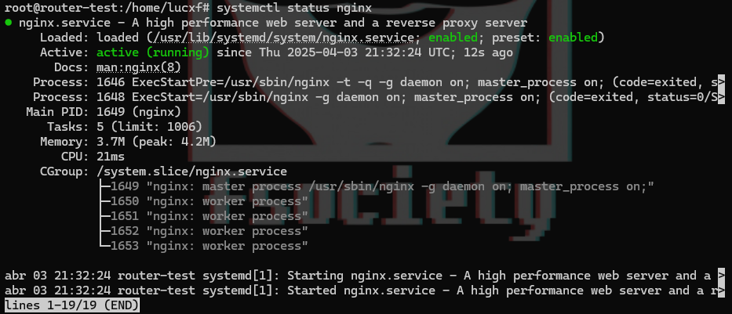
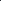
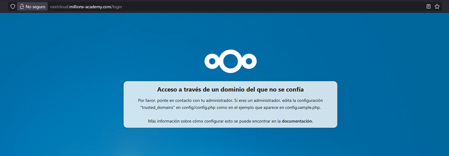
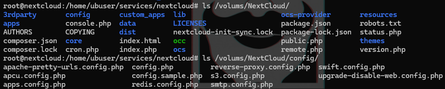
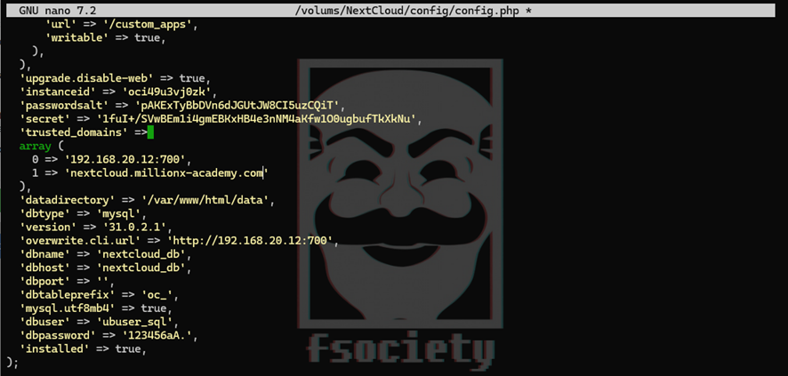
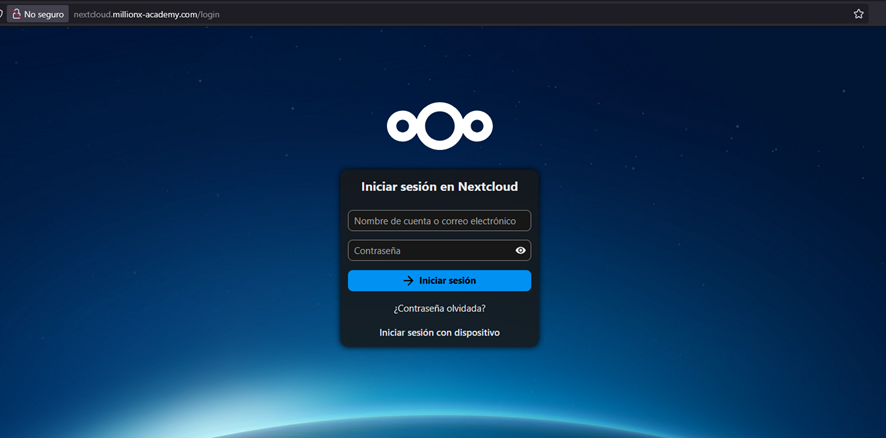

# REVERSE PROXY CON NGINX

[ngnix docu](https://docs.nginx.com/nginx/admin-guide/web-server/reverse-proxy/)
[yt video](https://www.youtube.com/watch?v=DyXl4c2XN-o)
[hostinguer docu](https://www.swhosting.com/en/comunidad/manual/how-to-create-a-reverse-proxy-with-nginx)

1. Instalar **nginx**

```bash
apt install nginx -y
```





2. Configurar el **sites-available**

Crear un fichero con el nombre del dominio, en este caso el fichero se llamará `millionx-academy.com.conf` con la extensión **.conf**

```conf
server {
    # Escuchar en el puerto 80 para el subdominio nextcloud.
    listen 80;

    # Nombre del servidor o subdominio.
    server_name nextcloud.millionx-academy.com;

    access_log /var/log/nginx/nextcloud.millionx-academy.com.access.log;

    location / {
        # Configuración del proxy para redirigir a la IP interna.
        proxy_pass http://192.168.20.12:700/;
        
        # Otras configuraciones del proxy (si es necesario).
        proxy_set_header Host $host;
        proxy_set_header X-Real-IP $remote_addr;
        proxy_set_header X-Forwarded-For $proxy_add_x_forwarded_for;
        proxy_set_header X-Forwarded-Proto $scheme;
    }
}
```

3. Enlace simbolico

```bash
sudo ln -s /etc/nginx/sites-available/millionx-academy.com.conf /etc/nginx/sites-enabled/
```

4. Reiniciar nginx

Una vez reiniciado nginx, nos daremos cuenta de que si accedemos tendremos problemas debido a que nos dice que no es de confianza, para ello tendremos que configurar mas cosas.

Tendremos que ir a nuestro nextcloud y editar el fichero `config.php` donde agregaremos dentro como tursted `nextcloud.millionx-academy.com`







Como podemos comprobar ya funciona correctametne, solo faltará el **TLS**



# TLS

1. Crear directorio donde guardar los certificados

```bash
mkdir -p /etc/nginx/ssl
chmod 700 /etc/nginx/ssl
```


2. Crear clave privada del certificado

```bash
openssl genpkey -algorithm RSA -out /etc/nginx/ssl/clave_privada.key
```


3. Crear una solicitud para certificado ssl

pones tus datos, email puede ser falso

```bash
openssl req -new -key /etc/nginx/ssl/clave_privada.key -out /etc/nginx/ssl/solicitud.csr
```


4. Creo el certificado usando la solicitud

```bash
openssl x509 -req -days 365 -in /etc/nginx/ssl/solicitud.csr -signkey /etc/nginx/ssl/clave_privada.key -out /etc/nginx/ssl/certificado.crt
```


```bash
server {
    # Escuchar en el puerto 80 para el subdominio
    listen 80;
    server_name millionx-academy.com nextcloud.millionx-academy.com webmin-dns.millionx-academy.com moodle.millionx-academy.com zabbix.millionx-academy.com grafana.millionx-academy.com;

    # Redirigir tráfico HTTP a HTTPS
    return 301 https://$host$request_uri;
}

server {
    listen 443 ssl;

    # Nombre del servidor o subdominio.
    server_name millionx-academy.com;

    # Certificados SSL
    ssl_certificate /etc/nginx/ssl/certificado.crt;
    ssl_certificate_key /etc/nginx/ssl/clave_privada.key;

    # Configuración de acceso
    access_log /var/log/nginx/millionx-academy.com.access.log;

    location / {
        # Configuración del proxy para redirigir a la IP interna.
        proxy_pass http://192.168.20.5:80/;
        
        # Otras configuraciones del proxy (si es necesario).
        proxy_set_header Host $host;
        proxy_set_header X-Real-IP $remote_addr;
        proxy_set_header X-Forwarded-For $proxy_add_x_forwarded_for;
        proxy_set_header X-Forwarded-Proto $scheme;
    }
}
```

5. RELOAD

```bash
nginx -s reload
```


